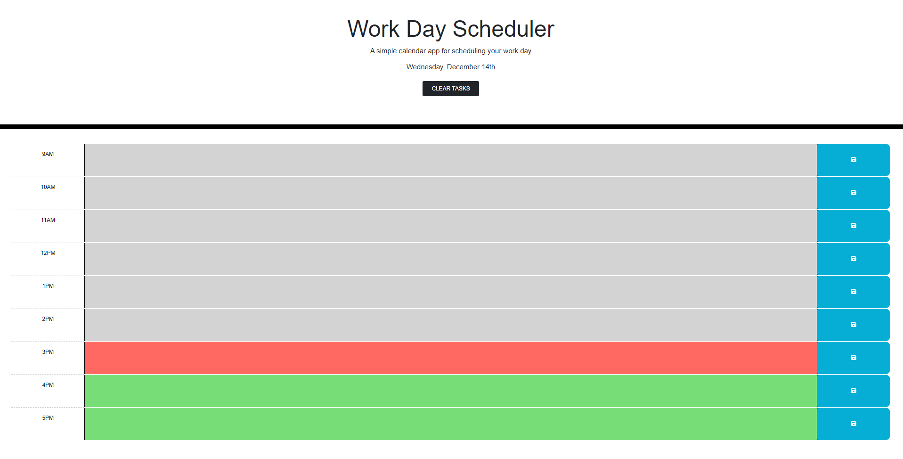

# Personal-Daily-Planner

## Description

A simple calendar application that allows a user to save events for each hour of the day.


## User Story

```md
AS AN employee with a busy schedule
I WANT to add important events to a daily planner
SO THAT I can manage my time effectively
```

## Acceptance Criteria

```md
GIVEN I am using a daily planner to create a schedule
WHEN I open the planner
THEN the current day is displayed at the top of the calendar
WHEN I scroll down
THEN I am presented with timeblocks for standard business hours
WHEN I view the timeblocks for that day
THEN each timeblock is color coded to indicate whether it is in the past, present, or future
WHEN I click into a timeblock
THEN I can enter an event
WHEN I click the save button for that timeblock
THEN the text for that event is saved in local storage
WHEN I refresh the page
THEN the saved events persist
```

## Installation


Live Link: https://harryward-15.github.io/Personal-Daily-Planner/

## Usage

This is my Personal Daily Planner, type in your schedule for the day and be sure to click save! Now you can open the page again later and see if you forgot anything. Once you have finished all your tasks, hit the clear tasks button to start again.

## Credits

UWA Bootcamp Spot - Starter code, User Story and Acceptance Criteria.

## License

Please see LICENSE file in repo
